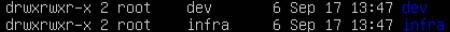

# **Exercice 1. Gestion des utilisateurs et des groupes**

1 - Pour ajouter les groupes dev et infra: **sudo groupadd dev** et **sudo groupadd infra**

2 - Afin de créer les utilisateurs en spécifiant la création de leur dossier personnel et avec bash pour shell, on execute les commandes:
* **sudo useradd -m -s /bin/bash alice**
* **sudo useradd -m -s /bin/bash bob**
* **sudo useradd -m -s /bin/bash charlie**
* **sudo useradd -m -s /bin/bash dave**

3 - On ajoute les utilisateurs dans les nouveaux groupes crées:
* **sudo usermod -a -G dev alice**
* **sudo usermod -a -G dev bob**
* **sudo usermod -a -G dev dave**
* **sudo usermod -a -G infra bob**
* **sudo usermod -a -G infra charlie**
* **sudo usermod -a -G infra dave**

4 - Une premire façon d'afficher les membres du groupe infra est de taper la commande **getent group infra** (on peut l'améliorer: **getent group infra | cut -d: -f4**).
Une seconde manière d'obtenir ceci peut se faire avec **cat /etc/group | grep 'dev'**; on peut encore améliorer cette commande afin qu'elle soit plus précise avec **cat /etc/group | grep -w 'dev' | cut -d: -f4**.

5 - dev devient le groupe propriétaire des répertoires /home/alice et /home/bob grâce aux commandes **sudo chown :dev /home/alice** et **sudo chown :dev /home/bob**. infra devient le groupe propriétaire des répertoires /home/charlie et /home/dave grâce aux commandes **sudo chown :dev /home/charlie** et **sudo chown :dev /home/dave**.

6 - On peut remplacer le groupe primaire des nouveaux utilisateurs que l'on a précédemment crées :
* **sudo usermod -g dev alice**
* **sudo usermod -g dev bob**
* **sudo usermod -g infra charlie**
* **sudo usermod -g infra dave**

7 - Création des dossiers : **sudo mkdir /home/dev**, **sudo mkdir /home/infra**.

Ensuite, on va changer le groupe propoiétaire de ces dossiers: **sudo chgrp dev dev** et **sudo chgrp infra infra**.

Par la suite, on spécifie le droit d'écriture: **sudo chmod g+w dev** et **sudo chmod g+w infra**.
Les groupes propriétaires des dossiers dev et infra ont maintenant la permission d'écrire dans ces dossiers.

Maintenant, les membres de dev ont la permission d'écrire dans ce dossier et les membres d'infra ont la permission d'écrire dans le dossier infra.